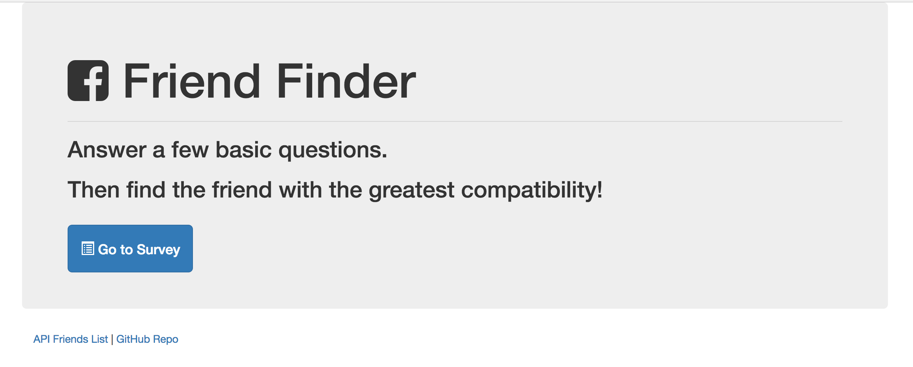
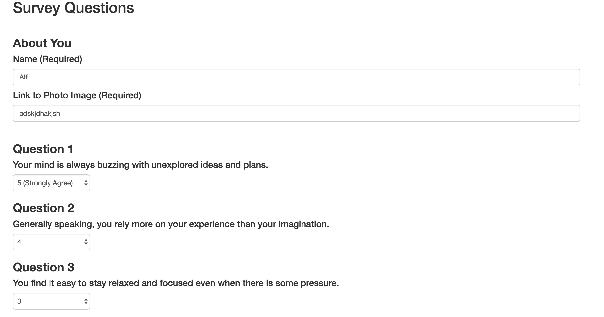
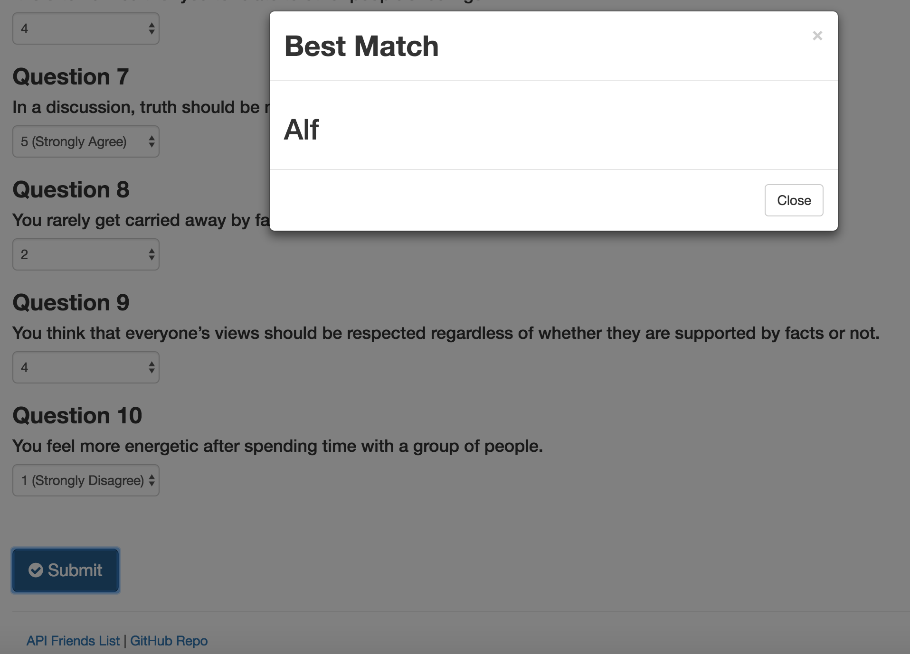

<h1 align="center">Friend-Finder</h1>

<h2>Info:</h2>

This web application allows you to fill out a survey and based on some dummy data inside the project to

match the user with the closest person they would be friends with.

<h2>Front Page</h2>

    

This starts up the application and allows you to start the survey or look at the Github Repo

<h2>Survey</h2>

    

<h2>Survey Done</h2>

    

<h3>Technologies used</h3>

<ul>
    <li><strong>HTML</strong></li>
    <li><strong>Express</strong></li>
    <li><strong>Javascript</strong></li>
    <li><strong>Node Modules Installed: Express, Path, Body-Parser</strong></li>
</ul>

<h3>Check it out!</h3>

<ul>
    <li><strong>https://friend-finder-appz.herokuapp.com/</strong></li>
</ul>
